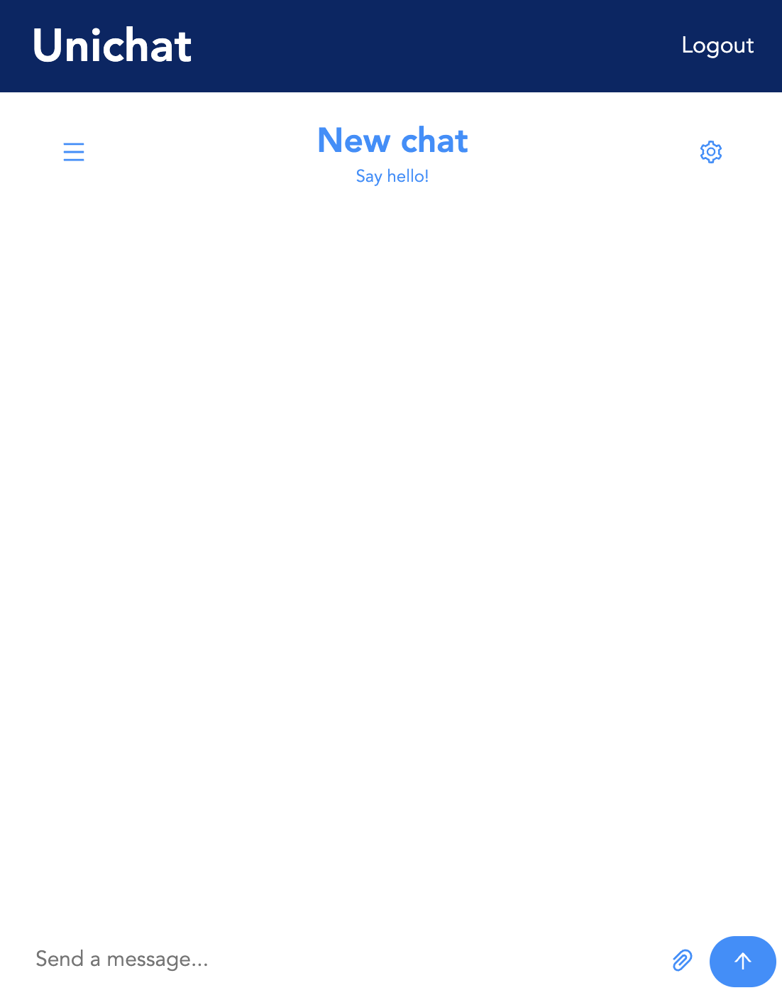

# unichat

<br/>
<p align="center">

</a>
</p>
<br/>

<br/>
<p align="center">

</a>
</p>
<br/>

## Summary

This project lets you chat with friends over the internet. It uses the "chatengine.io" and firebase as the backend.

And more!

- [unichat](#unichat)
  - [Summary](#summary)
  - [Prerequisites](#prerequisites)
- [Usage](#usage)
- [License](#license)

## Prerequisites

Please install or have installed the following:

- [nodejs and npm](https://nodejs.org/en/download/)

# Usage

After filling out the environmental variables, do the following:

```bash
npm run dev
```

It will open the project on "dev" mode

# License

This project is licensed under the [MIT license](LICENSE).
